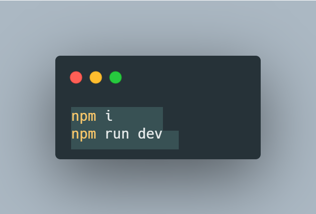

# Scout Management System

## About the Project

Scout management system is a website implemented using **PERN stack**. This project is a 2nd year CUFE project for practicing on the fundemental rules of database system management.

## Our website is now on air🔥

We deployed our website, although, it is still in progress so you might find some missing functoinalities.

To login as a general captain use:

> email: general@gmail.com
> pass: 1234

🔥[Website Link](https://scouts-managment-system-development.onrender.com/)🔥

## Why do you have to use this website?

This website is based on a well structured database and a user friendly app, which helps in providing the best managerial experience to the scout captains. It helps them in:

### Scout management

- Getting Scouts' absence and statistics over a certain interval
- Sending automatic notifications in case of exceeding the limit of absence
- Adding/removing them from/to any sector

### Sectors management

- Adding/removing new sectors from/to the system
- Managing leading captains
- Managing Absence for each sector's leading captains

### Activities and sessions

- Saving each activity including it's type, place and time
- Grading scouts on the activities they joined and showing stats

### Finance management

- Adding weekly subscriptions
- Adding incomes and expenses to the system
- Getting updated value of the total balance and each transaction has been done

### Stats

- Viewing attendance stats for scouts and captains
- Providing graphs for better analysis
- Getting reports on the current system status

## Pre-implementation phase

### Database design

ER-design and schema designs for the database

### User Stories

[User Stories](https://drive.google.com/file/d/1RwYU0OpM7EVVqLCTXDNxmlU7WgaKOdvz/view?usp=sharing)

### Figma Design

We have designed a complete UX design for all system pages: about 40 pages  

[View full figma design](https://www.figma.com/file/Yj8KCaGVDlDprgecgPdMwq/Scouts-Management-System?type=design&node-id=0%3A1&mode=design&t=rPMKLEZWaE6dBebp-1)

## How to run?

run the following commands in the terminal

## Contributers

|  |  |  |  |
| --------------------------------------------------------------------- | ------------------------------------------------------------- | --------------------------------------------------------------- | --------------------------------------------------------------- |
| [AbdelruhmanSamy](https://github.com/AbdelruhmanSamy/)                | [amir-kedis](https://github.com/amir-kedis/)                  | [akramhany](https://github.com/akramhany/)                      | [AhmedHamed3699](https://github.com/AhmedHamed3699)             |
