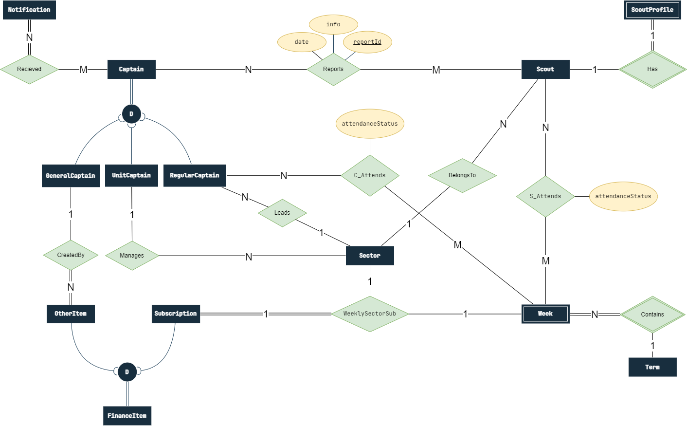
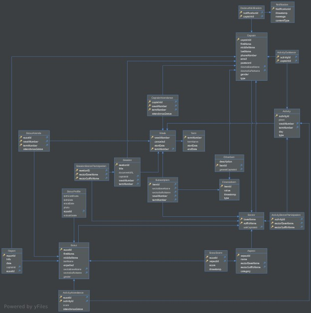
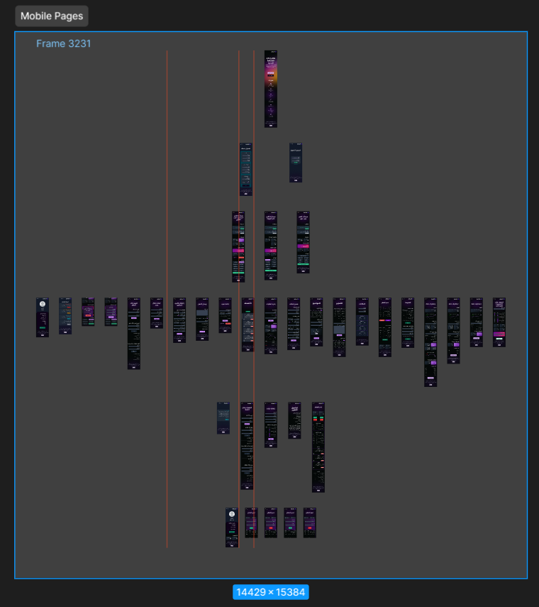

#  Kashafty

This is Kashafty! An SPA for managing all the scout groups needs. Attendance, finance, activities you name it! we got it! 😉

<!-- Scout management system is a website implemented using **PERN stack**. This project is a 2nd year CUFE project for practicing on the fundamental rules of database system management. -->

<!-- TODO: replace with an image that have Kashafty on it or maybe a GIF -->

## 🤔 But why?

- Have you ever tried to record the attendance of over 500 person using only a paper and a pen? Well, we did and it was a mess!
- Have you ever had to make reports on something and found yourself in the face of a huge pile of papers that is impossible to handle? guess what, we did too!
- as a leader, have you ever found yourself in a headache trying to manage the mess of data and reports that come from every direction with no clear structure? we totally understand you!

So we made `Kashafty` the solution for all scout groups' problems. It is a website that helps you manage all your scouts' data, activities, finance and much more!

<!-- ## Our website is now on air🔥 -->

<!-- We deployed our website, although, it is still in progress so you might find some missing functionalities. -->

<!-- To login as a general captain use: -->

<!-- > email: general@gmail.com -->
<!-- > pass: 1234 -->

## 🚀 Quick start

To get started navigate to [Kashafty demo](https://scouts-managment-system-development.onrender.com/) and use this account to try out the Main functionalities:

> - email:[general@gmail.com](general@gmail.com)
> - pass: 1234

you can also create your own account and try out the system as a regular captain.


## 📖 Documentation and features

This website is based on a well structured database and a user friendly app, which helps in providing the best managerial experience to the scout captains. It helps them in:

### Scout management

- Getting Scouts' absence and statistics over a certain interval
- Sending automatic notifications in case of exceeding the limit of absence
- Adding/removing them from/to any sector

### Sectors management

- Adding/removing new sectors from/to the system
- Managing leading captains
- Managing Absence for each sector's leading captains

### Activities and sessions

- Saving each activity including it's type, place and time
- Grading scouts on the activities they joined and showing stats

### Finance management

- Adding weekly subscriptions
- Adding incomes and expenses to the system
- Getting updated value of the total balance and each transaction has been done

### Stats

- Viewing attendance stats for scouts and captains
- Providing graphs for better analysis
- Getting reports on the current system status

## 🧰 Tech Stack

- **Frontend**

    

- **Backend**

  

## Pre-implementation phase

### Database design

ER-design and schema designs for the database





### Figma Design

We have designed a complete UX design for all system pages: about 40 pages



[View full figma design](https://www.figma.com/file/Yj8KCaGVDlDprgecgPdMwq/Scouts-Management-System?type=design&node-id=0%3A1&mode=design&t=rPMKLEZWaE6dBebp-1)

### User Stories

[User Stories](https://drive.google.com/file/d/1RwYU0OpM7EVVqLCTXDNxmlU7WgaKOdvz/view?usp=sharing)

## How to run locally?

after filling the `.env` file as required. run the following commands in the terminal

```bash
npm i
npm run dev
```

## Contributors

<!-- |  |  |  |  |
| --------------------------------------------------------------------- | ------------------------------------------------------------- | --------------------------------------------------------------- | --------------------------------------------------------------- |
| [AbdelruhmanSamy](https://github.com/AbdelruhmanSamy/)                | [amir-kedis](https://github.com/amir-kedis/)                  | [akramhany](https://github.com/akramhany/)                      | [AhmedHamed3699](https://github.com/AhmedHamed3699)             |
 -->

|  |  |  |  |
| ------------------------------------------------------------------------------------------------- | ----------------------------------------------------------------------------------------- | ------------------------------------------------------------------------------------------- | ------------------------------------------------------------------------------------------- |
| [AbdelruhmanSamy](https://github.com/AbdelruhmanSamy/)                                            | [amir-kedis](https://github.com/amir-kedis/)                                              | [akramhany](https://github.com/akramhany/)                                                  | [AhmedHamed3699](https://github.com/AhmedHamed3699)                                         |
